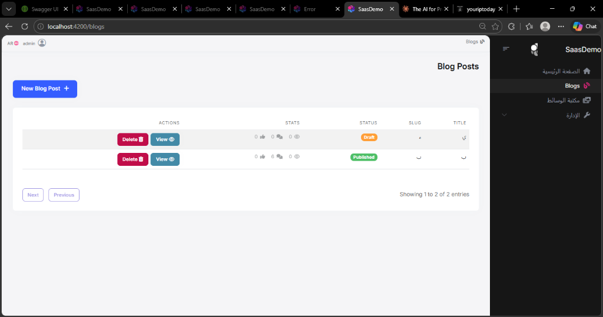
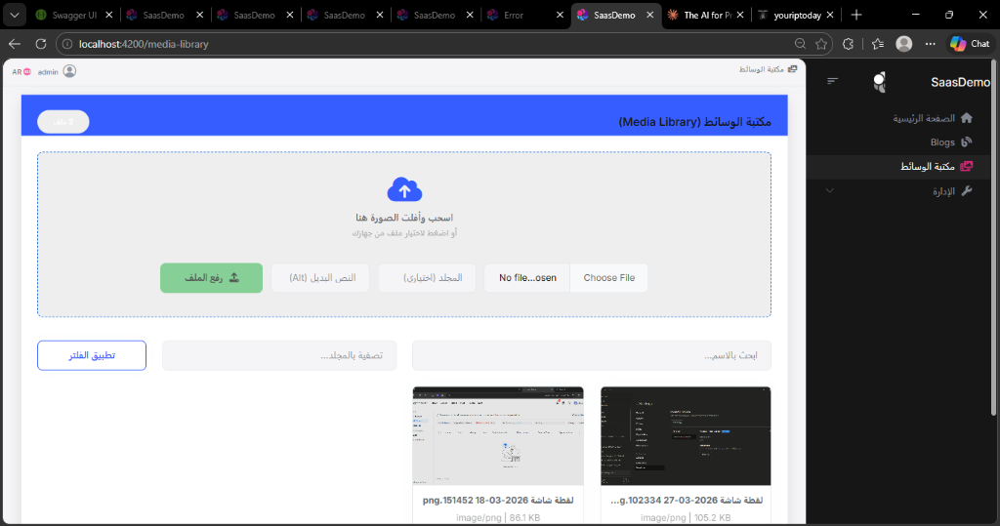
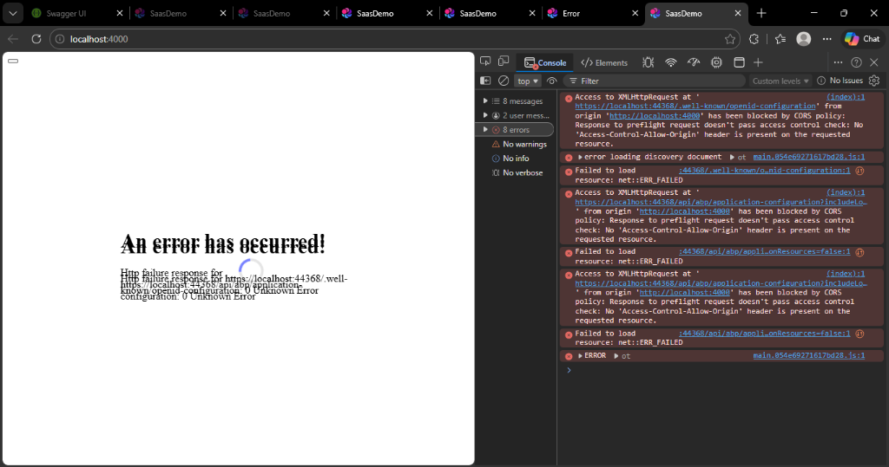

# SaasDemo: Production-Grade ABP & Angular Boilerplate 🚀

[](https://github.com/)
[](https://github.com/)
[](https://abp.io/)
[](https://angular.dev/)
[](https://dotnet.microsoft.com/)
[](https://opensource.org/licenses/MIT)

> **A production-grade open-source boilerplate built on ABP Framework + Angular, demonstrating enterprise patterns in a real working codebase.** 
> *(مشروع احترافي مفتوح المصدر مبني على بيئة عمل ABP Framework + Angular، يستعرض تصميمات وتطبيقات هيكلية معمارية قوية للأنظمة المؤسسية في بيئة حقيقية.)*

## 📖 About The Project

**SaasDemo** is a custom enterprise-grade boilerplate project built on top of the [ABP Framework](https://abp.io/) and Angular. It goes beyond standard scaffolding by manually implementing advanced enterprise patterns, proving that theoretical concepts can be beautifully translated into working code.

This project demonstrates how to properly integrate complex features like SEO, Media Libraries, and Content Versioning into a strict DDD environment.

## 📸 Screenshots & Showcase
- **Advanced Blog Editor (QuillJS + Media)**:
  

- **Centralized Media Library (Drag & Drop)**:
  

- **Nested Comments & SEO Integration**:
  

## ✨ Key Technical Achievements

- 🏛️ **Strict Clean Architecture & DDD**: Hand-crafted Entities and AppServices replacing generic scaffolding tools (`abphelper`) to maintain absolute domain integrity.
- 📝 **Professional CMS & Blogging Engine**:
  - Fully integrated **CmsKit** for nested comments and reactions.
  - Custom Content Versioning (Audit history, snapshots, and rollbacks).
  - Advanced SEO integration (Dynamic Title, OpenGraph Meta Tags for Googlebot).
  - Smart Slug generation (auto-incrementing, uniqueness handling).
- 🖼️ **Centralized Media Library**:
  - Drag & Drop uploading with visual feedback and hover animations.
  - Headless `BlobStoring` integration (locally stored, ready to swap to Azure/AWS).
  - Cross-module integration (Cover Image Picker Modal, custom Quill Editor image handlers, "Copy URL" features).
- ⚙️ **Debugging & Stability Techniques**:
  - Documented workarounds for ABP Lepton-X SSR incompatibilities directly in the project logs.
  - Manual permission seeding via `DbMigrator` eliminating caching and 403 authorization bugs.

## 🛠️ Tech Stack

- **Backend**: C#, ASP.NET Core 8, Entity Framework Core, SQL Server (Express).
- **Frontend**: Angular 17, TypeScript, ABP Lepton-X Lite Theme.
- **Libraries**: QuillJS, Serilog, Swashbuckle, Node.js.

## 🚀 Getting Started

If you want to pull this code to learn from it or experiment yourself:

### Prerequisites
- .NET 8 SDK
- Node.js (v20+) & NPM
- SQL Server LocalDB or SQLExpress (`nezar\SQLEXPRESS` by default)

### 1. Database & Migrations (Crucial)
Before running the app, you **must** run the Migrator to seed the database structure and initial permissions.
```bash
cd src/SaasDemo.DbMigrator
dotnet run
```

### 2. Run the Backend (API)
```bash
cd src/SaasDemo.HttpApi.Host
dotnet run
```

### 3. Run the Frontend (Angular)
Wait for the backend API to start successfully, then run the Angular app:
```bash
cd angular
npm install
npm start
```
The app will be available at `http://localhost:4200` by default.

## 💡 Inside The `.agent` Folder
This repository includes a special `.agent` directory containing a goldmine of bilingual (English/Arabic) documentation tracking the entire learning journey. This is how the AI and I communicate and maintain context:

| File | Purpose |
|---|---|
| `task.md` | The massive project roadmap (350+ hours), divided into phases and detailed checklists. |
| `project-memory.md` | Core framework patterns, completed modules, and critical technical "gotchas". |
| `decision-log.md` | A historical log of every major architectural decision (Why we did X instead of Y). |
| `current-context.md` | The active session state, recent accomplishments, and current focus/blockers. |
| `code-nodes.md` | A map of the database entities, DbSets, key services, and Angular components. |
| `standards.md` | The strict coding standards, Clean Architecture rules, and UI/UX guidelines we follow. |
| `testing-checklist.md` | A universal pre-deployment checklist validated before any merge. |
| `pair-programming.md` | The communication rules bridging the gap between human logic and AI execution. |
| `prompts-library.md` | Saved, highly-effective AI prompts used for scaffolding or complex logic generation. |
| `workflows/` | Specific step-by-step guides (e.g., how we handled SEO Meta Tags, why SSR failed, Git workflows). |

## 🤖 AI-Augmented Architecture
This project leverages advanced AI pair-programming methodologies to strictly enforce **Clean Architecture** and **DDD** boundaries. All architectural decisions, custom workflows, and prompts are documented transparently in the `.agent/` directory to share our AI-engineering approach with the community.

## 📄 License
Distributed under the MIT License. Feel free to clone, explore, fork, and learn from it!
