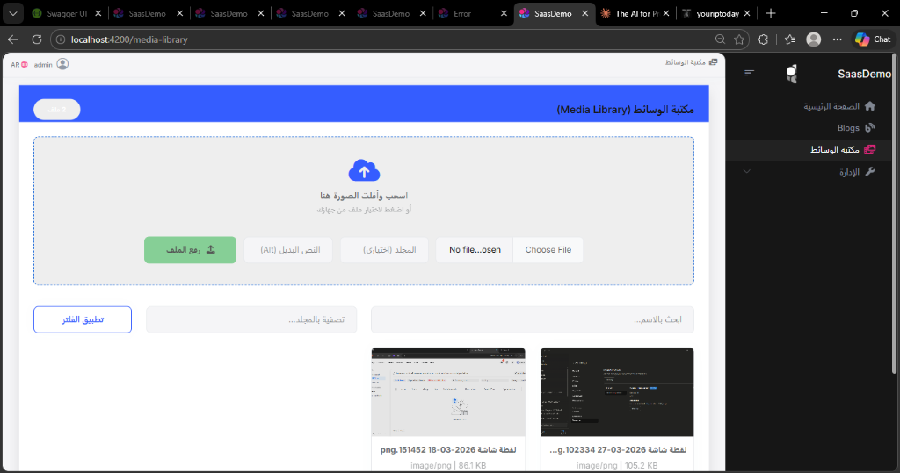
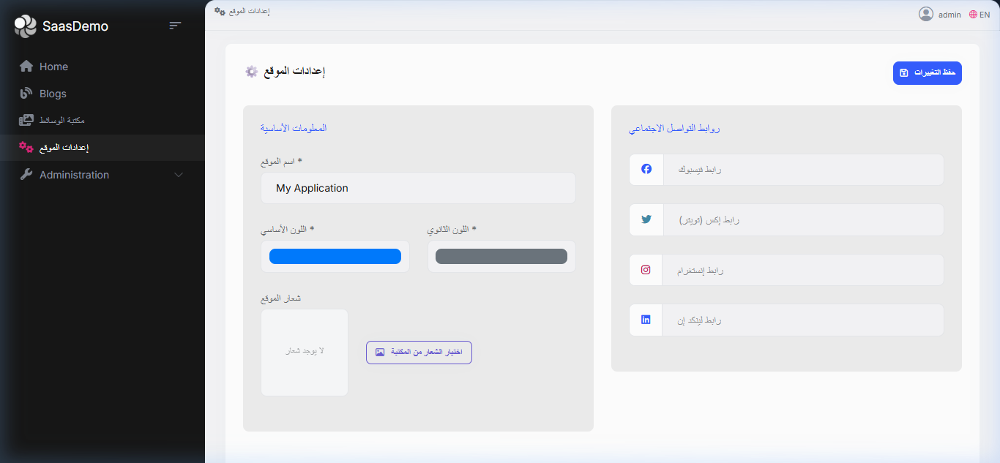
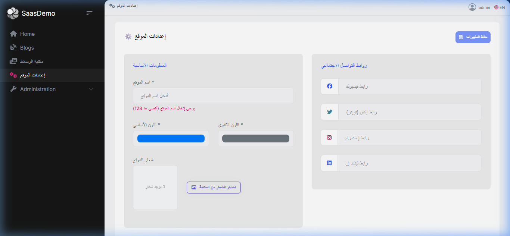
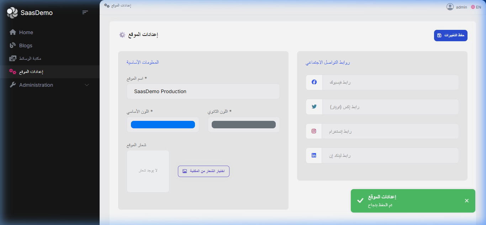

# SaasDemo: Production-Grade ABP & Angular Boilerplate 🚀

[](https://github.com/)
[](https://github.com/)
[](./evidence/testing/)
[](https://abp.io/)
[](https://angular.dev/)
[](https://dotnet.microsoft.com/)
[](https://opensource.org/licenses/MIT)

> **A production-grade open-source boilerplate built on ABP Framework + Angular, demonstrating enterprise patterns in a real working codebase.** 
> *(مشروع احترافي مفتوح المصدر مبني على بيئة عمل ABP Framework + Angular، يستعرض تصميمات وتطبيقات هيكلية معمارية قوية للأنظمة المؤسسية في بيئة حقيقية.)*

---

## 📖 About The Project

**SaasDemo** is a custom enterprise-grade boilerplate project built on top of the [ABP Framework](https://abp.io/) and Angular. It goes beyond standard scaffolding by manually implementing advanced enterprise patterns, proving that theoretical concepts can be beautifully translated into working code.

This project demonstrates how to properly integrate complex features like SEO, Media Libraries, Content Versioning, and dynamic Site Settings into a strict DDD environment — with **every feature tested and documented** like a real enterprise product.

---

## 📸 Feature Showcase

### 🖼️ Centralized Media Library — Drag & Drop with Live Preview


> Headless BlobStoring integration. Upload, search, copy URLs, and picker modals — all from one centralized library.

---

### ⚙️ Dynamic Site Settings — Full Admin Panel


> Singleton Entity pattern. Site branding, colors, logo from Media Library, social links, and SMTP configuration — all in one page.

---

### ✅ Real-Time Validation — Professional Error Handling


> Every form has client-side validation with Arabic localization. Required fields, max length, and format errors — all handled gracefully.

---

### 🎉 Save Confirmation — Success Toast Feedback


> After saving, users see instant visual feedback with a styled toast notification. Data persists after page reload (verified via QA).

---

## ✨ Key Technical Achievements

- 🏛️ **Strict Clean Architecture & DDD**: Hand-crafted Entities and AppServices replacing generic scaffolding tools (`abphelper`) to maintain absolute domain integrity.
- 📝 **Professional CMS & Blogging Engine**:
  - Fully integrated **CmsKit** for nested comments and reactions.
  - Custom Content Versioning (Audit history, snapshots, and rollbacks).
  - Advanced SEO integration (Dynamic Title, OpenGraph Meta Tags for Googlebot).
  - Smart Slug generation (auto-incrementing, uniqueness handling).
- 🖼️ **Centralized Media Library**:
  - Drag & Drop uploading with visual feedback and hover animations.
  - Headless `BlobStoring` integration (locally stored, ready to swap to Azure/AWS).
  - Cross-module integration (Cover Image Picker Modal, custom Quill Editor image handlers, "Copy URL" features).
- ⚙️ **Dynamic Site Settings Engine**:
  - Singleton Entity pattern (one row in DB, auto-created on first save).
  - Site branding: Name, Primary/Secondary Colors, Logo from Media Library.
  - Social Links management (Facebook, Twitter, Instagram, LinkedIn).
  - Email/SMTP configuration with secure password handling.
  - Professional Angular admin interface with real-time validation.
- 🔧 **Debugging & Stability Techniques**:
  - Documented workarounds for ABP Lepton-X SSR incompatibilities directly in the project logs.
  - Manual permission seeding via `DbMigrator` eliminating caching and 403 authorization bugs.

---

## 🎭 Quality Assurance — Enterprise-Grade Testing

> **Every feature is tested and documented before it's considered "done".** This project follows an enterprise QA workflow using a custom `/playwright-qa` skill that enforces structured testing with evidence collection.

### 📊 QA Process Per Feature
```
1. 🧪 Execute test scenarios (P0: Auth → P1: Core → P2: Edge Cases)
2. 📸 Capture screenshots at every major step (success + failure)
3. 🎬 Record full session video (.webp)
4. 📋 Generate official QA report (.md)
5. 🧾 Write Playwright E2E spec (.spec.ts)
6. 📁 Organize everything in evidence/testing/[feature]/
```

### 📂 Evidence Structure (Real Example)
```
evidence/testing/
├── qa-report-site-settings-2026-04-04.md    ← Official QA Report
└── site-settings/
    ├── 01-page-load.png                     ← Initial page state
    ├── 02-form-filled.png                   ← Form data entry
    ├── 03-save-result.png                   ← Success toast ✅
    ├── 04-empty-validation.png              ← Validation error ❌
    ├── 05-social-links.png                  ← Social section
    ├── 06-email-settings.png                ← SMTP section
    ├── 07-final-save.png                    ← Final save
    ├── 08-reload-verify.png                 ← Data persistence check
    └── session-video.webp                   ← Full session recording 🎬

tests/e2e/
└── site-settings.spec.ts                    ← Playwright E2E (6 scenarios)
```

### 📈 Latest QA Results
```
╔══════════════════════════════════╗
║     QA SESSION REPORT            ║
╠══════════════════════════════════╣
║ Feature : Site Settings          ║
║ Date    : 2026-04-04             ║
║ Result  : ✅ PASS                ║
║ Tests   : 7/7 Passed             ║
║ Bugs    : 0 Found                ║
╚══════════════════════════════════╝
```

---

## 🛠️ Tech Stack

- **Backend**: C#, ASP.NET Core 8, Entity Framework Core, SQL Server (Express).
- **Frontend**: Angular 17, TypeScript, ABP Lepton-X Lite Theme.
- **Testing**: Playwright, Custom QA Skill, Structured Evidence Collection.
- **Libraries**: QuillJS, Serilog, Swashbuckle, Node.js.

## 🚀 Getting Started

If you want to pull this code to learn from it or experiment yourself:

### Prerequisites
- .NET 8 SDK
- Node.js (v20+) & NPM
- SQL Server LocalDB or SQLExpress (`nezar\SQLEXPRESS` by default)

### 1. Database & Migrations (Crucial)
Before running the app, you **must** run the Migrator to seed the database structure and initial permissions.
```bash
cd src/SaasDemo.DbMigrator
dotnet run
```

### 2. Run the Backend (API)
```bash
cd src/SaasDemo.HttpApi.Host
dotnet run
```

### 3. Run the Frontend (Angular)
Wait for the backend API to start successfully, then run the Angular app:
```bash
cd angular
npm install
npm start
```
The app will be available at `http://localhost:4200` by default.

---

## 📁 Project Structure

```
SaasDemo/
├── aspnet-core/                → Backend (ABP + .NET 8 + EF Core)
│   ├── src/
│   │   ├── SaasDemo.Domain/           → Entities, Repositories, Domain Services
│   │   ├── SaasDemo.Application/      → AppServices, AutoMapper Profiles
│   │   ├── SaasDemo.EntityFrameworkCore/ → DbContext, Migrations, EF Repos
│   │   └── SaasDemo.HttpApi.Host/     → API Host, Controllers, Swagger
│   └── test/                          → Unit Tests (Domain + AppService)
│
├── angular/                    → Frontend (Angular 17 + Lepton-X)
│   └── src/app/
│       ├── blogs/                     → Blog CRUD + Detail + Editor
│       ├── media-library/             → Upload, Search, Picker Modal
│       ├── settings/                  → Site Settings Admin Panel
│       └── shared/                    → Reusable Components & Services
│
├── .agent/                     → AI Context & Documentation (Bilingual 🇬🇧🇸🇦)
│   ├── project-memory.md              → Module registry & architecture notes
│   ├── current-context.md             → Active session state & focus
│   ├── decision-log.md                → Architectural decisions history
│   ├── code-nodes.md                  → Entity/DbSet/Service reference map
│   ├── standards.md                   → Clean Architecture & DDD rules
│   ├── task.md                        → Project roadmap (350+ hours)
│   └── workflows/                     → 12 custom skills (29 total)
│
├── evidence/testing/           → QA Reports, Screenshots & Videos
├── tests/e2e/                  → Playwright E2E Specs
└── docs/                       → Project Documentation
```

---

## 🤖 AI-Augmented Architecture
This project leverages advanced AI pair-programming methodologies to strictly enforce **Clean Architecture** and **DDD** boundaries. All architectural decisions, custom workflows (29 skills), and prompts are documented transparently in the `.agent/` directory to share our AI-engineering approach with the community.

## 📄 License
Distributed under the MIT License. Feel free to clone, explore, fork, and learn from it!
